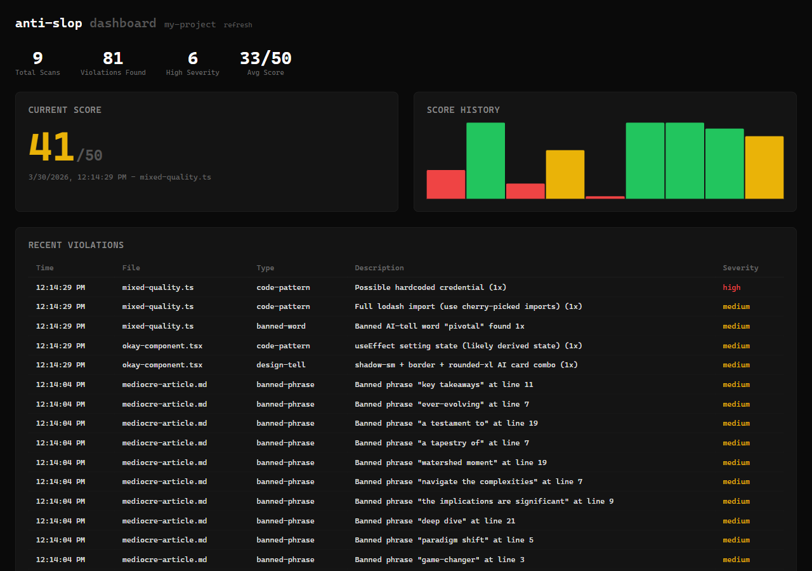

# anti-slop

A Claude Code plugin that scans for security vulnerabilities, accessibility failures, performance problems, and generic design defaults in AI-generated output.



## What it does

Loads pattern-matching rules during content generation. The rules target failure modes documented in published research.

On the **writing** side: vocabulary tells (words like "delve" show up 25-48x more often in AI text than human text per a 2024 Max Planck/Stanford study), sycophantic openers, structural cliches, filler phrases.

On the **code** side: SQL injection, XSS, path traversal, command injection, hardcoded credentials, `eval()`, swallowed errors, premature abstractions, comment slop, N+1 queries, missing timeouts, full library imports, `useEffect` misuse, shallow copy bugs, floating-point money, date/time errors, async race conditions.

On the **frontend** side: WCAG failures (AI code has 3-5x more accessibility violations per page than hand-written code — Deque 2024), missing states (empty, error, loading), the generic AI aesthetic, CSS z-index escalation, `!important` abuse, missing `prefers-reduced-motion`, hydration mismatches, and demo-ware that only handles the happy path.

On **regressions**: the fix-one-break-another pattern, test manipulation (weakening assertions to make tests pass), silent behavioral changes, and destructive operations.

Rules yield to domain context. Academic writing gets its hedging language. Legal writing keeps "ensure" and "comprehensive." ML code keeps "optimize" and "converge." If a banned word is the precise technical term for what you're doing, use it.

## What's included

| Component | Description |
|-----------|-------------|
| **Skill** (`anti-slop`) | Core rules, activates automatically on writes/edits/builds |
| **Agent** (`slop-detector`) | Deep semantic review, scores on 5 dimensions (50pt scale) |
| **Command** (`/slop-check`) | Manual review — point it at a file, diff, or PR |
| **MCP Server** (`anti-slop-scanner`) | Fast deterministic scanner — regex-based pattern matching for banned words, phrases, design tells, code smells, security issues. Three tools: `scan_file`, `get_dashboard_url`, `get_score_history` |
| **Web Dashboard** | Per-project score history, violation log, severity breakdown, multi-project navigation. Starts automatically, each project gets a deterministic port |
| **8 reference files** | ~230 banned words, ~210 banned phrases, plus pattern catalogs for writing, code, design, frontend, regressions, and self-check checklists |

The MCP scanner and the agent serve different purposes. The scanner is fast — it runs regex patterns against file content and returns in milliseconds. The agent is thorough — it reads reference files, understands context, and produces a scored report with specific fixes. The `/slop-check` command runs both: scanner first for a quick pass, then the agent for semantic analysis.

## The numbers

- AI-generated code has **2.74x more security vulnerabilities** than human-written code (CodeRabbit 2025). 100% of tested vibe-coded apps lacked CSRF protection (Escape.tech).
- **70-80% of AI-generated UI fails WCAG AA** without explicit instructions (University of Michigan 2025).
- AI-generated PRs contain **1.7x more issues**, 75% more logic errors, and 3x worse readability (CodeRabbit 2025).
- Refactoring dropped from 25% of changed lines to **under 10%** in AI-assisted codebases (GitClear 2024).
- Adam Wathan (Tailwind creator) apologized for `bg-indigo-500` being the demo default that trained every model.

## Installation

```bash
# Add the marketplace:
/plugin marketplace add https://github.com/TheMizeGuy/anti-slop

# Install:
/plugin install anti-slop@anti-slop
```

For development:

```bash
claude --plugin-dir /path/to/anti-slop
```

## Usage

The skill activates whenever you write, build, or edit code. For manual review:

```
/slop-check                              # review last output
/slop-check src/components/Header.tsx    # review specific file
/slop-check diff                         # review uncommitted changes
/slop-check pr                           # review current PR
```

The dashboard starts automatically when the MCP scanner runs its first scan. Score history and violation log persist in `.anti-slop/` in your project directory. If you're working across multiple projects, the dashboard shows tabs for all active projects.

### Configuration

Drop a `.anti-slop/config.json` in your project if you need to allow specific words the scanner flags:

```json
{
  "allowedWords": ["leverage", "ecosystem"]
}
```

## Scope

Tuned for web-centric code (Python, TypeScript, JavaScript, CSS) and English prose. Limited coverage for Rust, Go, C/C++, mobile (SwiftUI, Jetpack Compose), and ML pipelines. The word lists and pattern matchers are web-focused; the underlying principles (specificity, economy, correctness) apply anywhere.

## License

MIT
